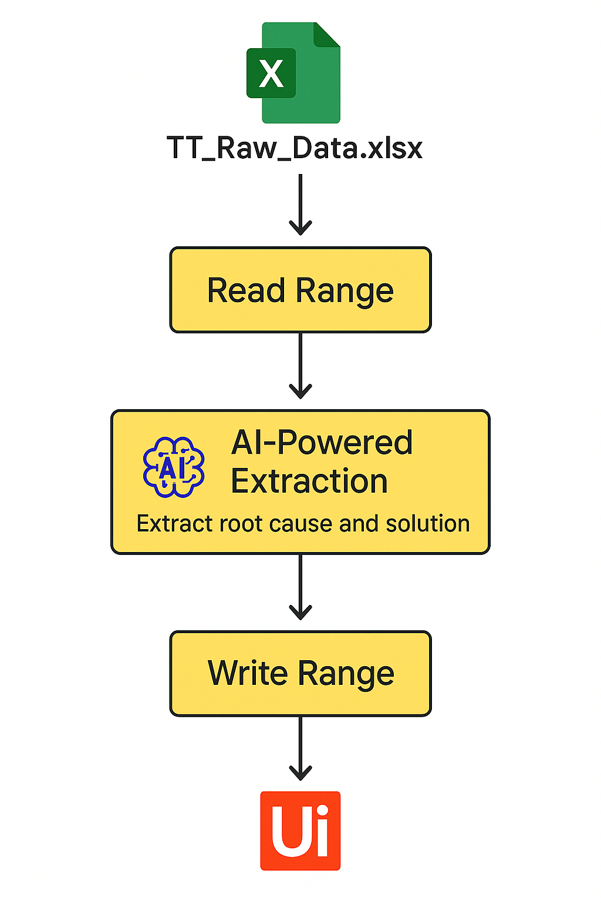

# 🧠 UiPath - TT-resolver


**TT-resolver** is an AI-powered UiPath automation that analyzes Technical Ticket (TT) logs, identifies the root cause, and suggests a solution. This tool is especially useful for telecom or IT operation centers to streamline ticket resolution.

---

## 📂 Project Structure

```
TT-resolver/
├── Main.xaml                     # Main UiPath workflow
├── TT_Raw_Data.xlsx              # Sample input Excel file with raw TT logs
├── .gitignore
├── README.md
├── .project/
├── .settings/
└── Logs/
```

---

## ⚙️ What It Does

- Reads a column of raw TT descriptions from `TT_Raw_Data.xlsx`.
- Uses AI content generation to:
  - Extract the **Root Cause** of the issue.
  - Suggest a **Solution**.
- Writes results into new columns in the same or a new Excel file.

---

## 🧪 Example

Input log (in Excel):
```
"Site down due to high temperature alarm. Blower motor not working team repaired the motor and reset it."
```

Output generated by automation:
```
Root Cause : High temperature due to blower motor failure.
Solution   : Repaired the blower motor and reset it.
```

---

## ✅ How to Run

1. Clone/download this repo.
2. Open `Main.xaml` in **UiPath Studio**.
3. Make sure `TT_Raw_Data.xlsx` is in the project root (or update the path).
4. Run the workflow in Debug or Run mode.
5. Output will appear in the Excel sheet (with additional columns).

---

## 🛠 Dependencies

- UiPath.Excel.Activities
- OpenAI/Gemini integration

---

## 📸 Workflow Overview



---

## ✍️ Author

Yamin Hassan  
[GitHub Profile](https://github.com/yshatory)

---

## 📃 License

This project is open-source and free to use under the [MIT License](https://opensource.org/licenses/MIT).
